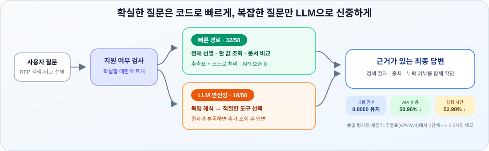

# 입찰메이트

  

> 코드잇 AI 스프린트 중급 프로젝트 2팀  
> 일반적인 top-k 검색만으로 놓치기 쉬운 <ins>전체 문서 조건 계산</ins>은 **추출표와 코드**가, <ins>문맥 설명과 예외 처리</ins>는 **원문 검색과 LLM이 담당**합니다.

## 핵심 성과

### 고정 조건에서 진행한 모델 구조 실험

| 실험 | 평가셋 / 채점기 / 추출표 | 전체 | 선별형 | 추출형 | QA형 | API 비용 | 실행 시간 |
|---|---|---:|---:|---:|---:|---:|---:|
| 베이스라인 + 추출표 | v2 / v2 / v4 | 0.7357 | 0.9114 | 0.4667 | 0.7000 | 약 $0.0087 | 43초 |
| 베이스라인 − 추출표 | v2 / v2 / v4 미사용 | 0.2505 | 0.1109 | 0.2667 | 0.5750 | 약 $0.0852 | 7분 31초 |
| 1단계 | v2 / v2 / v4 | 0.7400 | 0.9200 | 0.4667 | 0.7000 | — | — |
| 2단계－1차 | v2 / v2 / v4 | 0.7400 | 0.9600 | 0.4000 | 0.7000 | — | — |
| 2단계－1·2차 | v2 / v2 / v4 | 0.7300 | 1.0000 | 0.3333 | 0.6500 | — | — |
| 2단계－1·2·3차 | v2 / v2 / v4 | 0.8000 | 1.0000 | 0.5333 | 0.7000 | $0.2486 | 18분 7초* |
| **3단계 고속 경로** | **v2 / v2 / v4** | **0.8000** | **1.0000** | **0.5333** | **0.7000** | **$0.1219** | **8분 31초** |

\* **2단계 1·2·3차 수치 계산 방법:** 50문항을 처음 실행한 뒤 답변 출력 방식을 수정하고, 영향을 받은 추출형 8번과 11번만 다시 실행했습니다. 비교 수치는 **처음 실행한 50문항에서 기존 8·11번의 비용과 시간을 빼고, 다시 실행한 8·11번의 비용과 시간을 더하는 방식**으로 계산했습니다. 즉, **48문항은 첫 실행 결과, 2문항은 수정 후 재실행 결과**이며 최종 비교값은 **$0.2486·18분 7초**입니다. 재실행까지 포함해 실제 실험 전체에 사용한 비용과 시간은 **약 $0.2556·18분 36초**였습니다.

### 최신 프로젝트 결과 — 정답 범위 불일치 해결

| 평가셋 / 채점기 / 추출표 | 전체 | 선별형 | 추출형 | QA형 | API 비용 | 실행 시간 |
|---|---:|---:|---:|---:|---:|---:|
| **v3 / v3 / v5** | **0.9400 (47/50)** | **1.0000** | **1.0000** | **0.7000** | **약 $0.0693** | **4분 7초** |

> **왜 0.8000과 0.9400을 단순 비교하면 안 되는가**
>
> - **0.8000**은 평가셋 v2·채점기 v2·추출표 v4를 그대로 고정하고, 모델 구조만 바꾸며 측정한 점수입니다.
> - 당시 추출형 7문항은 모델이 올바른 문서·도구·필드를 선택했는데도 0점이었습니다. 추출표와 평가셋 정답이 요구하는 범위가 서로 달랐기 때문입니다. 예를 들어 추출표에는 평가 배점의 총점만 있지만 정답은 세부 배점까지 요구하거나, 추출표가 괄호 설명과 이어지는 문장을 별도 항목으로 나눠 채점기가 불필요한 추가 답변으로 판단하는 문제가 있었습니다. 정답에는 있지만 추출표에서 빠진 조건도 있었습니다.
> - 이를 해결한 **추출표 v5**에서는 7문항에 영향을 주는 6개 항목의 누락 내용·목록 경계·표현을 원문에 맞게 바로잡았습니다. **평가셋 v3**은 기존 50개 질문과 정답을 바꾸지 않고, 추출표 출처 기록 719개를 v5에 맞게 갱신했습니다. **채점기 v3**에는 GPT-5 계열 호출 호환성 수정이 반영됐습니다.
> - 그 결과 최신 조합인 평가셋 v3·채점기 v3·추출표 v5에서는 전체 **0.9400**, 추출형 **1.0000**이 나왔습니다. 다만 이는 모델만 좋아진 결과가 아니라 **평가셋과 추출표의 정답 범위 불일치를 함께 해결한 결과**이므로, 모델 성능이 0.8000에서 0.9400으로 향상됐다고 해석하지 않습니다.
> - QA형 점수는 개발용 문자열 기반 심판으로 측정한 값이므로, 의미 충실성을 평가하는 공식 최종 점수는 아닙니다.

## 실험이 다음 실험을 만든 과정

> 아래 실험은 모델 구조의 효과만 비교하기 위해 평가셋 v2·채점기 v2·추출표 v4를 동일하게 고정했습니다.

**베이스라인 → 1단계 계획 구조화 → 2단계 결과 관찰 → 독립 이중 해석 → 검토 기록 재사용 → 추출 답변 직접 조립 → 3단계 고속 경로**

### 0. 베이스라인 — 추출표가 정말 필요한가?

**발견한 병목**  
베이스라인은 코드 규칙으로 질문을 해석하고 추출표 또는 원문 검색을 선택했습니다. 빠르고 저렴했지만, 새로운 자연어 표현이 생길 때마다 규칙을 추가해야 했습니다.

**검토한 후보**

1. 추출표 없이 일반적인 원문 검색만 사용
2. 추출표는 유지하고 질문 해석 방식만 개선

**실험과 결과**  
추출표를 끄자 전체 점수는 **0.7357 → 0.2505**, 선별형은 **0.9114 → 0.1109**로 떨어졌습니다. 실행 시간도 **43초 → 7분 31초**, 비용은 **약 $0.0087 → 약 $0.0852**로 증가했습니다.

**다음 판단**  
일반적인 top-k 원문 검색만으로는 검색 대상 98건의 조건을 빠짐없이 계산하기 어려웠습니다. 따라서 추출표는 유지하고, 코드가 담당하던 자연어 해석을 개선하기로 했습니다.

### 1. 1단계 — LLM이 질문을 한 번 구조화

**해결하려던 병목**  
코드 규칙만으로 다양한 자연어 표현을 계속 해석하기 어려웠습니다.

**검토한 후보**

1. 질문 표현마다 코드 규칙을 계속 추가
2. LLM이 질문을 정해진 형식의 실행 계획으로 변환

2번을 선택해 LLM이 전체 조건 선별·값 추출·문서 비교·원문 검색·되묻기 중 하나를 고르게 했습니다. 코드는 문서·필드·조건을 검증한 뒤 도구를 한 번 실행했습니다.

**결과와 다음 병목**  
전체 점수는 **0.7357 → 0.7400**으로 거의 변하지 않았고 추출형은 **0.4667**로 같았습니다. 자연어 규칙을 코드에서 분리했지만, 최초 계획이 틀리거나 조회 결과가 부족해도 다시 판단할 수 없었습니다.

### 2. 2단계 — 도구 결과를 보고 다시 판단

**해결하려던 병목**  
1단계는 처음 선택한 도구가 틀리거나 결과가 부족해도 다음 행동을 할 수 없었습니다.

**실제 적용**  
LLM이 도구 결과를 확인하고, 필요한 경우 다른 도구를 추가 호출하도록 바꿨습니다. 최대 세 번까지 조회와 판단을 반복할 수 있게 했습니다.

**새롭게 발견한 병목**  
결과를 다시 확인하더라도 LLM이 질문을 처음부터 잘못 이해하면 잘못된 결과를 성공으로 판단할 수 있었습니다.

**검토한 후보**

1. 코드가 LLM의 자연어 이해를 다시 검사
2. 더 성능이 높은 별도 LLM이 최초 계획을 검토
3. 같은 질문을 독립적으로 두 번 해석하고, 결과가 다를 때만 추가 검토

1번은 베이스라인처럼 자연어 규칙을 코드에 계속 추가해야 하는 문제로 돌아갑니다. 2번은 가장 높은 효과가 기대되는 방법이었지만, 프로젝트에서 사용할 수 있는 모델이 gpt-5-mini와 gpt-5-nano로 제한되어 상위 모델을 검토기로 사용할 수 없었습니다. 따라서 상위 모델 검토가 추가 비용만큼 실제 성능을 높이는지 확인하지 못했습니다. 이러한 제약 안에서 최초 해석 오류를 방어할 수 있는 3번을 2단계－1차로 실험했습니다.

> 2단계 자체는 구조를 만들고 병목을 확인한 단계입니다. 독립된 50문항 점수 비교는 2단계－1차부터 시작했습니다.

### 3. 2단계－1차 — 독립적인 두 번의 해석

**해결하려던 병목**  
한 번의 잘못된 질문 해석이 전체 실행을 잘못된 방향으로 이끄는 문제였습니다.

**실제 적용**

- 같은 LLM이 서로의 답을 보지 않고 질문을 두 번 해석
- 두 계획이 같으면 그대로 실행
- 다르면 양쪽을 모두 조회한 뒤 하나를 선택하거나 사용자에게 재확인

코드는 자연어를 다시 해석하지 않고 두 구조화된 계획의 차이만 비교했습니다.

**결과와 다음 병목**  
전체는 **0.7400**, 선별형은 **0.9600**으로 개선됐지만 추출형은 **0.4000**으로 낮아졌고 비용은 약 **$0.1831**로 증가했습니다. 최초 해석 오류는 일부 방어했지만, 매번 두 번 해석하는 비용과 최종 답변 생성 문제가 남았습니다. 서로 다른 해석과 최종 선택 기록을 다음 질문에 재사용할 수 있는지도 확인할 필요가 있었습니다.

### 4. 2단계－1·2차 — 검토된 처리 기록 재사용

**해결하려던 병목**  
비슷한 질문이 반복되어도 이전에 올바르게 판단한 문서·도구·조건을 다시 처음부터 선택해야 했습니다.

**검토한 후보**

1. 모든 실행 기록을 자동으로 사용
2. 사용자의 반응을 곧바로 올바른 기록으로 저장
3. 후보 기록을 모은 뒤 개발자가 검토한 기록만 사용

잘못된 기록이 자동으로 쌓이는 것을 막기 위해 3번을 선택했습니다.

**실제 적용**  
2단계－1차에서 생긴 해석 불일치 기록을 후보로 보관했습니다. 개발자 역할을 맡은 검토 LLM이 평가셋·추출표·실행 기록과 대조하고, 올바르다고 확인한 기록만 **올바른 기록으로 승격**했습니다.

이 기록에는 최종 정답 문장을 저장하지 않았습니다. 해당 질문을 처리할 때 **어떤 문서·도구·조건·필드를 선택하는 것이 올바른지**를 저장했습니다. 새 질문과 올바른 기록의 질문을 **text-embedding-3-small**로 벡터화해 의미가 가장 가까운 기록을 찾고, 최초 계획과 두 해석이 충돌했을 때의 최종 선택에 참고시켰습니다. 즉, 과거 답을 복사한 것이 아니라 검증된 **처리 방향**을 재사용했습니다.

**결과와 다음 병목**  
선별형은 **0.9600 → 1.0000**, 출처 정확도는 **0.9565 → 0.9783**으로 올랐지만 전체는 **0.7400 → 0.7300**, 추출형은 **0.4000 → 0.3333**으로 낮아졌습니다. 올바른 문서·도구·조건을 선택해도 최종 답변 생성에서 점수를 잃을 수 있다는 사실을 확인했습니다.

### 5. 2단계－1·2·3차 — 추출 결과를 코드로 직접 조립

**해결하려던 병목**  
추출표에서 올바른 값을 찾고도 LLM이 최종 답변을 만들면서 항목을 빼거나 값을 바꾸고, 불필요한 설명을 더하는 문제가 있었습니다.

**검토한 후보**

1. 프롬프트를 더 강하게 작성
2. 더 성능이 좋은 LLM 사용
3. 확인된 추출표 값은 LLM이 다시 쓰지 않고 코드가 그대로 조립

가장 재현성이 높은 3번을 선택했습니다.

**실제 적용**  
문서·필드·조회 결과가 모두 확정된 경우 코드는 추출표 값을 정해진 형식으로 출력했습니다. 조회 결과가 부족하거나 문맥 설명이 필요한 질문만 기존 원문 검색과 LLM 경로를 유지했습니다.

**결과와 다음 병목**  
전체는 **0.7300 → 0.8000**, 추출형은 **0.3333 → 0.5333**으로 올랐습니다. 생성 단계가 실제 병목이었다는 가설을 확인했습니다. 남은 추출형 오답 7개는 올바른 문서·도구·필드를 선택했지만 추출표와 평가 정답이 요구하는 범위가 달랐습니다. 이 불일치는 이후 추출표 v5·평가셋 v3에서 정렬했습니다.

다만 품질을 회복하는 과정에서 LLM 호출이 늘어 50문항 실행에 비교 기준 약 **$0.2486·18분 7초**가 필요했습니다.

### 6. 3단계 — 코드 고속 경로와 LLM 안전망 결합

**해결하려던 병목**  
2단계－1·2·3차는 점수를 회복했지만, 정답이 구조적으로 확정된 질문에도 LLM을 반복 호출해 시간과 비용이 컸습니다.

**검토한 후보**

1. 쉬운 질문을 별도의 소형 LLM에 맡김
2. 확실한 질문은 코드가 처리하고, 불확실한 질문만 2단계－1·2·3차 경로로 전달

베이스라인에서 확인한 코드 경로의 속도와 비용 이점을 활용하기 위해 2번을 선택했습니다.

**실제 적용**  
전체 조건 선별, 한 문서의 한 필드 추출, 여러 문서의 정해진 필드 비교처럼 계약이 완전히 닫힌 질문만 고속 경로로 처리했습니다. 조금이라도 불확실하거나 실행에 실패하면 기존 LLM 안전망으로 전달했습니다.

**결과**

- 고속 경로: **32/50문항**, API 호출 0회
- LLM 안전망: **18/50문항**
- 2단계－1·2·3차와 문항별 내용 점수 차이: **0/50**
- 비용: **$0.2486 → $0.1219, 50.96% 절감**
- 시간: **18분 7초 → 8분 31초, 52.98% 절감**
- 생성 호출: **167회 → 66회**, 질문 임베딩 호출: **61회 → 29회**

최종 3단계는 모든 질문을 LLM에 맡기지 않습니다. 정답을 구조적으로 확정할 수 있는 질문은 추출표와 코드가 처리하고, 설명·검색·예외 판단이 필요한 질문은 LLM 안전망이 처리합니다.

### 실험을 통해 얻은 핵심 인사이트

1. 전체 문서 조건 계산에는 일반적인 top-k 검색보다 구조화된 추출표가 효과적이었습니다.
2. LLM이 질문을 올바르게 이해하는 것만으로는 충분하지 않았습니다.
3. 올바른 문서·도구·필드를 선택해도 최종 답변 생성에서 점수를 잃을 수 있었습니다.
4. 확정된 값은 LLM이 다시 작성하는 것보다 코드로 조립하는 편이 안정적이었습니다.
5. 모든 질문에 LLM을 호출하지 않아도 품질을 유지할 수 있었습니다.
6. 규칙 기반 고속 경로와 LLM 안전망을 결합해 품질을 유지하면서 비용과 시간을 줄였습니다.

### 프로젝트 실험의 한계

1. **후속 질문 기능이 제한적입니다.** 같은 실행에서 특정 문서 한 건을 이어 묻는 것은 가능하지만, 터미널을 다시 실행하면 앞선 대화가 사라집니다. 여러 문서 결과에서 범위를 좁히거나 “예”, “1번”, “그중 예산이 있는 것”처럼 답하는 대화도 안정적으로 이어지지 않습니다.
2. **추출표 밖의 내용을 전체 문서에서 빠짐없이 찾는 기능이 없습니다.** 특정 문서의 원문 검색은 가능하지만, 98개 전체 문서의 제목·설명을 훑어 문자열 포함·제외·OR 조건을 조합하는 전수 검색 도구는 구현하지 못했습니다.
3. **고속 경로가 지원하지 않는 질문을 간혹 성공으로 잘못 판단할 수 있습니다.** 답이 충분하지 않은데도 완료로 판단하면 LLM 안전망으로 넘어가지 않을 수 있습니다.
4. **LLM 안전망의 결과가 완전히 일정하지 않습니다.** 같은 질문도 드물게 해석이 달라지거나 실행 오류가 발생할 수 있습니다.
5. **평가셋 밖의 일반화 성능은 충분히 검증하지 못했습니다.** 승인 기록과 일부 평가 질문이 겹쳐 기록 실험의 결과를 새로운 질문에 대한 일반화 성능으로 해석할 수 없으며, 후속 대화와 전체 원문 복합 검색도 공식 50문항에 포함되지 않았습니다.
6. 최신 **0.9400**은 팀 개발용 50문항 결과이며 숨은 최종 평가셋 점수가 아닙니다. QA형은 개발용 문자열 기반 심판을 포함하므로 사람의 의미 품질 검증이 추가로 필요합니다.
7. 원본 RFP와 대용량 청크·벡터는 용량과 관리 정책 때문에 저장소에 포함하지 않았습니다. 청크 v4·인덱스 v3는 안전성 개선은 확인했지만 현재 50문항에서 내용 점수 향상이 입증되지 않아 후보로 유지합니다.

## 왜 일반적인 RAG만으로 부족했나

사용자가 다음과 같이 질문한다고 가정합니다.

> 예산이 5억 원 이상인 사업을 모두 보여주세요.

벡터 검색은 관련성이 높은 문서 조각을 찾는 데 강하지만, 검색 대상 98건을 모두 검사했다는 보장은 없습니다. 상위 5개 조각만 보고 답하면 조건에 맞는 공고를 빠뜨릴 수 있습니다.

입찰메이트는 질문에 따라 책임을 나눕니다.

- **선별형:** 추출표 전체를 코드로 계산해 조건을 만족하는 문서를 빠짐없이 찾습니다.
- **추출형:** 확인된 값과 목록을 LLM이 다시 쓰지 않고 정해진 형식으로 조립합니다.
- **QA형:** 원문 청크를 검색해 문맥이 필요한 설명을 생성합니다.
- **모호한 질문:** 문서를 임의로 고르지 않고 후보를 제시하거나 다시 묻습니다.

## 시스템 구조

~~~mermaid
flowchart LR
    Q["사용자 질문"] --> P["구조화된 질문 해석"]
    P --> G{"결정적으로 처리 가능한가?"}

    G -->|예| F["규칙 고속 경로"]
    F --> T["추출표 · identity 조회"]
    T --> C["조건 계산 · 값 직접 조립"]

    G -->|아니오| A["LLM 안전망"]
    A --> R["원문 청크 검색"]
    A --> T
    R --> L["근거 기반 설명 생성"]

    C --> V["출처 · 누락 · 형식 검사"]
    L --> V
    V --> O["최종 답변"]
~~~

### 구성요소별 책임

| 구성요소 | 담당하는 일 | 담당하지 않는 일 |
|---|---|---|
| 추출표 v5 | 100문서 × 12필드의 값·상태·근거 위치 제공 | 긴 문맥 설명 생성 |
| 코드 실행기 | 숫자·금액·날짜 정규화, 조건 계산, 값 보존 | 새로운 자연어 의미 추측 |
| 벡터 검색 | 질문과 관련된 원문 청크 탐색 | 전체 문서 조건 전수 계산 |
| gpt-5-mini | 질문 구조화, 문맥 설명, 예외 처리 | 검증된 값을 임의로 변경 |
| 채점기 v3 | 선별·추출·QA·출처·기권을 분리 측정 | 개발용 stub 결과를 공식 점수로 선언 |

## 주요 기능

| 기능 | 질문 예시 | 실행 방식 |
|---|---|---|
| 전체 조건 선별 | “예산 5억 원 이상인 사업을 모두 보여줘” | 추출표 전체 조건 조회 |
| 특정 값 추출 | “RFP-000038의 예산과 공동수급 조건은?” | 구조화 값 직접 조립 |
| 여러 문서 비교 | “두 사업의 예산과 사업기간을 비교해줘” | 문서 × 필드 비교표 생성 |
| 근거 기반 QA | “이 사업의 추진 배경을 설명해줘” | 원문 검색 + LLM 생성 |
| 모호성 처리 | “그 사업의 제출 방식은?” | 활성 문서 확인 또는 되묻기 |
| 회사 맞춤 공고 추천 | 회사 지역·분야·자격 입력 | 우선 검토 / 확인 필요 / 마감 임박으로 분류 |

## 빠른 시작

### 1. 실행 환경

- Python 3.10 이상
- OpenAI API 접근 권한
- 공식 청크·인덱스·등록부가 배치된 RAG_ROOT

~~~bash
git clone https://github.com/kim-tae-yoon-0718/ai12-team02.git
cd ai12-team02
git checkout dev

python3 -m venv .venv
source .venv/bin/activate
python -m pip install -e ".[dev]"
python -m pip install openai numpy gradio
~~~

> 팀 서버에서는 공유 가상환경 /srv/rfp/venv를 기준으로 검증했습니다. pyproject.toml의 기본 의존성 외에 모델 실행에는 openai, 벡터 로딩에는 numpy, 데모에는 gradio가 필요합니다.

### 2. 환경변수

~~~bash
export RAG_ROOT=/srv/rfp
export OPENAI_API_KEY="YOUR_API_KEY"
~~~

API 키를 저장소, 로그, 결과 JSONL에 기록하지 마세요.

### 3. 질문 하나 실행

~~~bash
python3 src/scripts/answer_pipeline.py \
  --question "예산이 5억 원 이상인 사업을 모두 보여줘"
~~~

### 4. 데모 실행

~~~bash
python3 demo/app.py
~~~

Gradio 화면에서 두 기능을 사용할 수 있습니다.

- **질문하기:** RFP 질의응답과 근거 확인
- **회사 매칭:** 회사 정보를 바탕으로 입찰 후보 추천

## 공식 입력 버전

| 자료 | 현재 기본값 | 위치 |
|---|---|---|
| 코퍼스 | v2 | $RAG_ROOT/shared_data/processed/corpus_v2 |
| 전처리 | v2 | 설정 및 데이터 매니페스트 |
| 청크 | v3 | $RAG_ROOT/shared_data/processed/chunks_v3 |
| 문서 등록부·identity | v2 | $RAG_ROOT/shared_data/processed/document_registry_v2 |
| 추출표 | v5 | data/preprocessed/rfp_extraction_table_v5 우선 |
| 벡터 인덱스 | v2 | $RAG_ROOT/shared_data/processed/index_v2 |
| 평가셋 | v3 | data/evalsets/final/v3/items.jsonl |
| 채점기 | v3 | config/grader.yaml |

### 후보 자산

청크 v4와 인덱스 v3는 품질 비교를 위한 **후보본**입니다. 현재 기본 실행에는 연결하지 않습니다.

- 후보 설정: config/experiments/chunking_v4.yaml
- 후보 인덱스 설정: config/experiments/index_v3_chunks_v4.yaml
- 기존 청크 v3와 인덱스 v2는 유지됩니다.

## 평가 재현

### 50문항 실행

~~~bash
python3 src/scripts/run_eval.py \
  --evalset data/evalsets/final/v3/items.jsonl \
  --out outputs/run50
~~~

생성되는 핵심 파일:

- responses.jsonl: 채점기에 전달하는 최종 응답
- details.jsonl: 문항별 경로·오류 단계·비용 진단
- summary.json: 실행 결과 요약
- api_cost_summary.json: 호출 수·토큰·비용·시간

### 개발용 채점

~~~bash
grader run \
  --evaluation-set data/evalsets/final/v3/items.jsonl \
  --responses outputs/run50/responses.jsonl \
  --mode development \
  --corpus v2 --preprocess v2 --table v5 \
  --index v2 --evalset v3 --scorer v3 \
  --out-dir outputs/score
~~~

### 자동 테스트

~~~bash
python -m pytest
~~~

pyproject.toml은 모델·청킹·채점기 테스트를 모두 수집하도록 설정돼 있습니다.

## 안전장치

- 공식 추출표·identity·청크가 없으면 다른 버전으로 조용히 대체하지 않고 중단합니다.
- 인덱스 생성 계보와 현재 조회용 추출표 버전을 별도 축으로 검사합니다.
- 문서 후보가 여러 개면 임의로 첫 문서를 선택하지 않습니다.
- 추출표의 값 상태가 충돌이면 하나를 고르지 않고 위치와 함께 알립니다.
- 문항 오류와 API 차단을 정상 답변으로 숨기지 않습니다.
- 실행 결과에 사용한 데이터 버전, 경로, 비용과 오류 단계를 남깁니다.

## 저장소 구조

~~~text
ai12-team02/
├── config/                    # 공식 설정과 실험별 오버레이
├── data/
│   ├── evalsets/final/v3/     # 개발용 공식 평가셋
│   └── preprocessed/
│       └── rfp_extraction_table_v5/
├── demo/                      # Gradio 데모
├── docs/                      # 구조·스키마·채점·검증 문서
├── src/
│   ├── chunking/              # 문서 청킹
│   ├── grader/                # 평가·채점 파이프라인
│   ├── rag/                   # 검색·라우팅·도구 실행 모듈
│   └── scripts/               # 질문·평가·인덱스 실행 진입점
├── tests/                     # 채점기 및 통합 테스트
└── tools/company_match/       # 회사 정보 기반 입찰 후보 추천
~~~

## 기술 스택

- **Language:** Python
- **Generation:** OpenAI gpt-5-mini
- **Embedding:** OpenAI text-embedding-3-small (1,536차원)
- **Vector search:** NumPy 기반 경량 저장소, cosine similarity
- **Schema & config:** Pydantic, PyYAML
- **Demo:** Gradio
- **Evaluation:** Pytest, 자체 평가셋·다층 채점기

## 팀 기여

| 담당 | 주요 기여 |
|---|---|
| 박예진 | 문서 전처리, 구조 보존 청킹, 인덱스 생성·검증 |
| 김태윤 | 구조화 추출표, 의미 기반 모델 실험, 최종 경로 통합 |
| 임현진 | 평가셋 구축, 데모 구현·통합 |
| 김하루 | 다층 채점기, 출처·기권·회귀 진단 |
| 이태민 | 검색·생성 베이스라인, 회사 정보 기반 공고 추천 |

## 문서

- [응답 계약](docs/response_contract.md)
- [채점 방식](docs/scoring.md)
- [검증 규칙](docs/validation.md)

---

입찰메이트는 “더 큰 모델 하나”보다 **추출표·코드·검색·LLM이 각자 잘하는 일을 맡는 구조**를 선택했습니다. 결과가 틀렸을 때도 모델 전체를 막연히 수정하지 않고, 질문 이해 → 문서·도구 선택 → 값 조회 → 답변 조립 → 채점의 어느 단계에서 실패했는지 추적할 수 있도록 설계했습니다.

