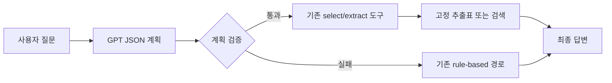
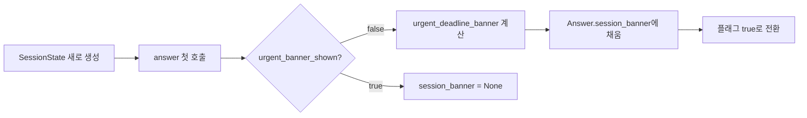

# 이태민 RFP RAG 실험 결과

> ⚠️ **2026-09-09 갱신 — 이 문서는 평가셋 v2·채점기 v2·추출표 v4 기준 결과다.**
> dev가 `평가셋 v3`·`채점기 v3`·`추출표 v5`로 공식 승격되면서 `taemin-experiment`
> 브랜치를 최신 dev 위로 rebase했다. 아래 결과·수치는 과거 실행 기록으로만
> 보존하고, 수정하지 않는다(실제로 그렇게 실행됐기 때문). 새 공식 자료 기준
> 재실행 명령은 이 문서 끝의 "다음 실행(v3 재실행)" 절을 본다 — 이 환경에는
> 원격 서버(`/srv/rfp`)·API 키가 없어 이번 재적용 작업에서는 코드만 맞추고
> 실제 재실행은 하지 않았다.

> **한 줄 결론**
> 현재 평가셋에서는 `top_k: 3`과 `gpt-5-mini` 조합이 가장 합리적인 기준값이다.
> select `phrased`는 표시 형식 개선으로 채택 가능하며, token 상한 2048/8192와 nano는 뚜렷한 우위를 만들지 못했다.

## 결과 카드

| 항목                | 확인 결과                                                                       |
| ------------------- | ------------------------------------------------------------------------------- |
| 평가                | 50문항 · 정상 실행본 기준 에러 0건                                             |
| 가장 작은 검색 설정 | `top_k: 3`                                                                    |
| 권장 생성 모델      | `gpt-5-mini`                                                                  |
| 권장 출력 상한      | `max_completion_tokens: 4096`                                                 |
| 표시 형식           | select`phrased`                                                               |
| 보류                | rerank · 공식 채점기 v2 재채점 · Stage1 전체 평가 · 마감 임박 필터 전체 평가 |

- 실행일: 2026-09-07
- 평가셋: `data/evalsets/final/v2/items.jsonl` (50문항, v2)
- 실행 코드: `src/scripts/run_eval.py`
- 런타임 루트: `/srv/rfp`
- 기본 모델: `gpt-5-mini` / `text-embedding-3-small`
- 기준 `top_k`: 5
- 기준일: `2024-06-01`

## 실행 환경

```bash
cd /home/spai1222/rfp-code
source /srv/rfp/venv/bin/activate
export RAG_ROOT=/srv/rfp
export HF_HOME=/srv/rfp/models
```

공식 입력 자료는 `index_v2`, `chunks_v3`, `extraction_table_v4`, `identity_v2`를 사용했다.

## 실험 요약

| 실험            | 변경값                           | 기권율 | 분기 폴백 | 에러 |  비용(USD) | 결과 폴더                                    |
| --------------- | -------------------------------- | -----: | --------: | ---: | ---------: | -------------------------------------------- |
| top-k 3         | `top_k: 3`                     |  16.0% |         6 |    0 | 0.00746832 | `/srv/rfp/runs/taemin_topk3_api`           |
| top-k 5         | baseline                         |  16.0% |         6 |    0 | 0.00728927 | `/srv/rfp/runs/taemin_topk5_api`           |
| top-k 8         | `top_k: 8`                     |  16.0% |         6 |    0 | 0.00987952 | `/srv/rfp/runs/taemin_topk8_api`           |
| select phrased  | `select_output_style: phrased` |  16.0% |         6 |    0 | 0.00769007 | `/srv/rfp/runs/taemin_select_phrased`      |
| completion 2048 | `max_completion_tokens: 2048`  |  16.0% |         6 |    0 | 0.00699127 | `/srv/rfp/runs/taemin_max_completion_2048` |
| completion 8192 | `max_completion_tokens: 8192`  |  16.0% |         6 |    0 | 0.00747727 | `/srv/rfp/runs/taemin_max_completion_8192` |
| model nano      | `generation_model: gpt-5-nano` |  16.0% |         6 |    0 |     미계산 | `/srv/rfp/runs/taemin_model_nano`          |

모든 정상 실행본에서 route 분포는 동일했다.

- `chunks검색_LLM답변`: 5건
- `identity_v2_값조회`: 1건
- `애매_되묻기`: 6건
- `추출테이블_값조회`: 14건
- `추출테이블_문서선별`: 23건
- `추출테이블_비교조립`: 1건

### 읽는 법

- **기권율**: 시스템이 답변을 확정하지 않고 되물었거나 보류한 비율
- **분기 폴백**: 초기 분류 규칙이 기본 QA 경로로 폴백한 횟수
- **비용**: 해당 실행의 API 비용. nano는 단가 미설정으로 `미계산`
- **정확도**: 실행 지표와 공식 채점기 v2 결과를 분리해 해석한다.

## 실험별 관찰

### 1. top-k 3 / 5 / 8

세 설정 모두 기권율 16.0%, 폴백 6건, 에러 0건으로 동일했다. 현재 평가셋에서 검색·생성 경로는 5문항뿐이며, 최종 답변 차이도 확인되지 않았다.

비용은 top-k가 커질수록 반드시 단조 증가하지는 않았지만, top-k 8은 3·5보다 높았다. 현재 결과만으로 품질 우위를 확인할 수 없으므로 `top_k: 3`을 비용·검색량이 작은 실험 기준값으로 채택하는 판단이 가능하다.

실험 설정 파일:

- `config/experiments/taemin_topk3.yaml`
- `config/experiments/taemin_topk8.yaml`

### 2. select 출력 형식

기본 raw 형식은 다음과 같다.

```text
- RFP-000072 — 사업분야: 농림수산
```

phrased 형식은 다음과 같다.

```text
- RFP-000072: 사업분야: 농림수산
```

select 23문항 중 21문항에서 문자열이 달라졌지만, 문서·조건·값은 같았다. 기권율·라우팅·에러 변화는 없었다. 따라서 `phrased`는 품질 변경이 아니라 표시 형식 개선으로 보는 것이 맞다.

실험 설정 파일:

- `config/experiments/taemin_select_phrased.yaml`

관련 코드 변경:

- `src/scripts/answer_pipeline.py`
- 기본값은 `raw`라서 기존 동작은 유지된다.

선택된 답변은 실제 실행 결과에서 확인할 수 있다.

```text
/srv/rfp/runs/taemin_select_phrased/responses.jsonl
```

### 3. max_completion_tokens 2048 / 8192

두 설정 모두 기권율·폴백·에러·route 분포가 같았다. 현재 50문항 답변은 2048 토큰 제한에 걸리지 않은 것으로 보이며, 이 평가셋에서는 8192로 올려도 관찰 가능한 품질 이득이 없었다.

실험 설정 파일:

- `config/experiments/taemin_max_completion_2048.yaml`
- `config/experiments/taemin_max_completion_8192.yaml`

### 4. gpt-5-mini / gpt-5-nano

두 모델 모두 기권율 16.0%, 폴백 6건, 에러 0건이었다. QA 경로 5문항을 비교하면:

- `QA-001`: nano가 더 자연스러운 문단형, mini가 더 구조적이고 인용 수가 많음(mini 3개, nano 2개)
- `QA-002`: 동일
- `QA-003`: 동일
- `QA-004`: 띄어쓰기·표현만 차이
- `QA-010`: 둘 다 `확인할 수 없습니다.`

RFP 시스템의 핵심인 근거 충실성 기준에서는 현재 표본상 `gpt-5-mini`가 더 보수적이고 안전하다. nano는 가격표가 설정되지 않아 비용은 계산되지 않았다.

nano 실행 사용량:

- 생성 요청 5건
- 임베딩 요청 5건
- 생성 출력 토큰 7,186
- 에러 0건

실험 설정 파일:

- `config/experiments/taemin_model_nano.yaml`

## 실행상 주의사항

처음 실행한 top-k 3 결과(`/srv/rfp/runs/taemin_topk3`)는 API 키가 없는 상태라 QA 5건이 실패했다. 비교에는 사용하지 않고, 정상 실행본인 `taemin_topk3_api`만 사용했다.

## Stage1 planner 추가 구현

기존 베이스라인을 바로 교체하지 않고, 실험 플래그로 켤 수 있는 Stage1 초안을 추가했다.



현재 Stage1이 전달하는 계획:

- `task_type`: 질문 경로
- `fields`: 공식 12필드 중 조회 항목
- `conditions`: 허용된 필드·연산자·값
- `document_ids`: 형식 검증된 RFP ID 목록

관련 파일:

- [planner.py](../src/rag/planner.py)
- [plan_v1.txt](../prompts/plan_v1.txt)
- [taemin_stage1_planner.yaml](../config/experiments/taemin_stage1_planner.yaml)
- [test_planner.py](../src/tests/test_planner.py)

검증 결과: planner 및 select 회귀 테스트 `290 passed`.

Stage1 전체 평가는 아직 실행하지 않았다. 현재 구현은 select 조건과 extract 필드 전달부터 검증하는 1차 수직 슬라이스이며, 문서 특정 강제와 compare 계획 실행은 후속 범위다.

## 마감 임박 필터 + 대화 시작 배너

`deadline_urgent_days` 옵션을 추가해, select 경로의 기존 마감 필터(`apply_deadline_filter`)를 "안 지난 마감 전부"에서 "기준 시각부터 N일 이내"로 좁힐 수 있게 했다. 여기서 한 걸음 더 나가, 질문 내용과 무관하게 **대화(세션) 시작 시 한 번만** 마감 임박 공고를 안내하는 배너 기능도 얹었다 — 실제 서비스라면 사용자가 대화를 시작하는 시점에 해당한다.



- `urgent_deadline_documents()`: identity_v2 전체에서 마감 임박 문서를 마감일 오름차순으로 계산(순수 함수)
- `urgent_deadline_banner()`: 배너 텍스트 생성. `deadline_urgent_days` 미설정이면 `None`
- `Answer.session_banner`: 채점기 응답 계약(`answer_to_response`, 하루님 쪽과 합의된 고정 스키마)에는 **포함하지 않음** — 채점 대상 답변과 섞이지 않도록 별도 필드로 분리. 실제 서비스 레이어가 `Answer` 객체에서 직접 읽어가는 구조.

⚠️ 최초 구현(Copilot 작업분)은 이 실험과 무관하게 `reference_datetime_source`에 `"now"`를 허용하도록 바꿔놨었다 — `⭐now 금지` 확정 원칙(1-9 ④)과 충돌해서 되돌렸다. 이번 실험 config는 원래도 `external`만 쓰므로 영향 없음.

관련 파일:

- [identity_metadata.py](../src/rag/identity_metadata.py) — `urgent_deadline_documents`
- [answer_pipeline.py](../src/scripts/answer_pipeline.py) — `urgent_deadline_banner`, `SessionState.urgent_banner_shown`, `Answer.session_banner`
- [taemin_deadline_urgent_7_external.yaml](../config/experiments/taemin_deadline_urgent_7_external.yaml)
- [test_deadline_urgent_filter.py](../src/tests/test_deadline_urgent_filter.py)

검증 결과: 신규 테스트 10개 포함 전체 회귀 `2117 passed, 4 skipped`. 실제 평가(`run_eval.py`)는 아직 실행하지 않았다 — API 키가 있는 터미널에서 아래 "다음 실행" 명령으로 진행한다.

## 결론

현재 평가셋과 실행 결과 기준 권장값은 다음과 같다.

- 검색: `top_k: 3`
- 생성 모델: `gpt-5-mini`
- 출력 토큰: `max_completion_tokens: 4096` 유지
- select 출력: `phrased` 채택 가능
- rerank: 구현 부재로 실험 보류

다만 최종 모델·top-k 확정 전에는 채점기 v2로 `responses.jsonl`의 정답 정확도와 근거 회수율을 별도 계산해야 한다. 이번 비교의 기권율과 route 분포만으로 정확도를 확정할 수는 없다.

## 다음 실행 (v3 재실행 — 아직 미실행, 원격 서버에서 진행 필요)

`taemin-experiment`를 최신 dev(`평가셋 v3`·`채점기 v3`·`추출표 v5`) 위로 rebase하면서
아래 명령들의 `--evalset` 경로를 v2→v3로 갱신했다. 이 환경에는 원격 서버(`/srv/rfp`)
접근권한도 API 키도 없어 실제 실행은 하지 못했다 — 아래 명령을 그대로 서버에서
돌리면 된다.

베이스라인 회귀 확인(50문항, top_k 5 기본값 — 기존 베이스라인과 점수 비교용):

```bash
python3 src/scripts/run_eval.py \
	--evalset data/evalsets/final/v3/items.jsonl \
	--out /srv/rfp/runs/taemin_baseline_v3_recheck \
	--max-item-retries 1
```

Stage1 실험:

```bash
python3 src/scripts/run_eval.py \
	--evalset data/evalsets/final/v3/items.jsonl \
	--out /srv/rfp/runs/taemin_stage1_planner_v3 \
	--experiment-config config/experiments/taemin_stage1_planner.yaml \
	--max-item-retries 1
```

마감 임박 필터 실험:

```bash
python3 src/scripts/run_eval.py \
	--evalset data/evalsets/final/v3/items.jsonl \
	--out /srv/rfp/runs/taemin_deadline_urgent_7_v3 \
	--experiment-config config/experiments/taemin_deadline_urgent_7_external.yaml \
	--max-item-retries 1
```

실행 전제: `RAG_ROOT=/srv/rfp`, 공식 `index_v2`·`chunks_v3`·`extraction_table_v5`·`identity_v2`, 그리고 API 키가 설정된 동일 터미널. 채점기 재채점은 `채점기 v3`(`src/grader`)로 진행한다.
